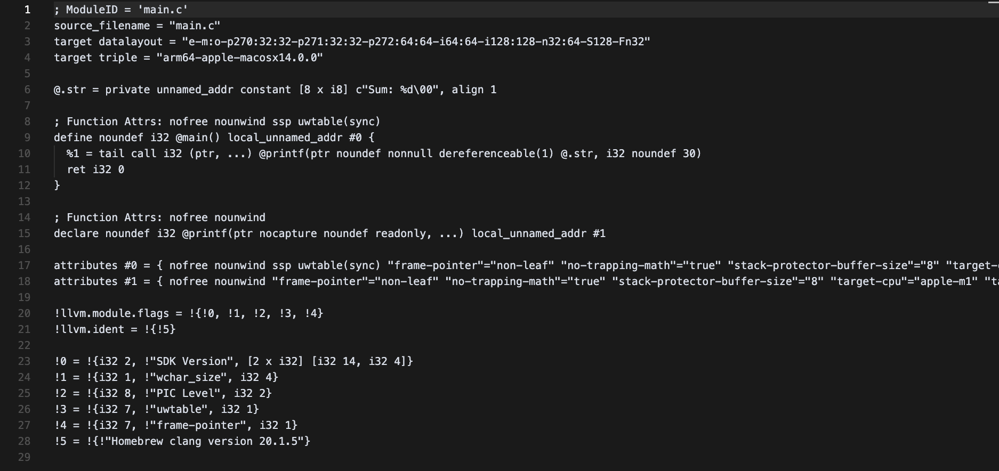

# Лабораторная работа 7. Преобразование и анализ кода с использованием Clang и LLVM
Цель работы: Познакомиться с инструментами Clang и LLVM, научиться собирать AST и IR-промежуточное представление кода на C/C++, а также извлекать базовую информацию о программе (например, список функций).
Задачи:
1. Установить Clang и LLVM;
2. Скомпилировать простой C-файл с использованием clang и
получить его: абстрактное синтаксическое дерево (AST), промежуточное
представление LLVM IR;
3. Использовать opt для применения базовой комплексной
оптимизации (например, О2);
4. Построить граф потока управления (CFG) для оптимизированной
программы;
5. Проанализировать результат, сделать выводы и ответить на
контрольные вопросы.

## Ход работы

### 1. Установка и подготовка среды

Работа выполнялась в среде **Mac OS Sonoma 14.4**. Установлены следующие инструменты:

- `clang` — компилятор языка C/C++.
- `llvm` — инструменты анализа и оптимизации кода.
- `opt` — инструмент для работы с LLVM IR и применения оптимизаций.
- `Graphviz` — инструмент для визуализации кода.

Команда установки необходимых инструментов через Homebrew:
```bash
brew install llvm graphviz
```

### 2. Исходный код

Пример программы `main.c`:
```c
#include <stdio.h>

int main() {
    int a = 10;
    int b = 20;
    int sum = a + b;
    printf("Sum: %d", sum);
    return 0;
}
```


### 3. Получение AST

Команда для генерации AST:
```bash
clang -Xclang -ast-dump -fsyntax-only main.c
```


### 4. Генерация LLVM IR

Команда для генерации LLVM IR:
```bash
clang -S -emit-llvm main.c -o main.ll
```


### 5. Оптимизация IR

Команда для генерации неоптимизированного IR:
```bash
clang -O0 -S -emit-llvm main.c -o main_O0.ll
```

Особенности IR до оптимизации:
- Переменные `a`, `b`, и `sum` (представленные как `%2`, `%3`, `%4` соответственно) явно выделяются в памяти на стеке с использованием инструкции `alloca`. `%1` также выделен для хранения возвращаемого значения `main`.
- Присваивание значений констант (`10`, `20`) и результата сложения (`sum`) выполняется с помощью инструкции `store`. Чтение значений переменных перед сложением и перед вызовом `printf` выполняется с помощью инструкции `load`.
- Функция `printf` вызывается с аргументом, загруженным из памяти.
- Код прямолинеен и соответствует структуре исходного C-кода.


Команда для генерации оптимизированного IR с уровнем `-O2`:
```bash
clang -O2 -S -emit-llvm main.c -o main_O2.ll
```

Особенности IR после оптимизации:
- В оптимизированном коде полностью отсутствуют инструкции alloca, load и store для переменных a, b, и sum.
- Компилятор определил, что `a` и `b` являются константами, и вычислил их сумму (`10 + 20 = 30`) на этапе компиляции. Сами переменные и операции над ними стали излишними.
- Инструкции, связанные с выделением памяти и манипуляциями с переменными `a`, `b`, `sum`, были определены как "мертвый" код после выполнения свертывания констант и были удалены.
- Результат сложения (константа `30`) напрямую передается в функцию `printf` в качестве аргумента.



Команда для сравнения IR до и после оптимизации:
```bash
diff main_O0.ll main_O2.ll
```


Изменения после оптимизации:
- Удалены alloca (Переменные, размещавшиеся в памяти, устранены)
- Устранены load/store и промежуточные вычисления (Операции доступа к памяти и промежуточные сложения удалены)
- Константы вычислены на этапе компиляции (Результат сложения (30) вычислен заранее)
- Прямая передача константы в printf


### 6. Граф потока управления программы

Команда для генерации `.dot`-файлов CFG:
```bash
opt -passes=dot-cfg -disable-output main_O2.ll
```

Создается DOT-файл:
- `.main.dot` — для функции `main`.

Команда для преобразования `.dot` в `.png`:
```bash
dot -Tpng .main.dot -o cfg_main.png
```


### 7. Ответы на контрльные вопросы

1. Clang — это фронтенд-компилятор для языков C, C++, Objective-C и других. Его задача — парсить исходный код, строить абстрактное синтаксическое дерево (AST) и превращать его в промежуточное представление LLVM IR. Clang — часть инфраструктуры LLVM и служит первым этапом компиляции.

2. LLVM — это модульная компиляторная инфраструктура, включающая инструменты и библиотеки для анализа, оптимизации и генерации кода. Она используется как основа для создания компиляторов, где Clang генерирует LLVM IR, а остальные компоненты LLVM занимаются оптимизацией и генерацией машинного кода под разные архитектуры.

3. AST — это структурированное дерево, отражающее синтаксис исходного языка. Оно сохраняет семантику и структуру кода высокого уровня.
LLVM IR — низкоуровневое представление, ближе к машинному коду, предназначено для оптимизации и трансформации. AST нужен для анализа на этапе фронтенда, IR — для последующей генерации и оптимизации кода.

4. IR — это универсальный формат, который упрощает анализ, оптимизацию и трансляцию кода. Он абстрагирует конкретные языки и аппаратные архитектуры, позволяя применять одни и те же оптимизации к разным языкам и платформам.

5. `alloca` выделяет память на стеке внутри функции. Обычно используется для создания локальных переменных. Память автоматически освобождается при выходе из функции. Это аналог `int x`; в C, но на уровне IR.

6. Оптимизация повышает производительность, уменьшает размер кода, снижает энергопотребление. Основные цели:
- Устранение избыточных операций
- Упрощение вычислений
- Повышение локальности данных
- Улучшение использования регистров и памяти

7. SSA (Static Single Assignment) — форма представления кода, где каждая переменная присваивается один раз. Новое присваивание = новая версия переменной. Это упрощает анализ зависимостей и позволяет применять мощные оптимизации (например, устранение мёртвого кода, постоянное свёртывание).

8. CFG (Control Flow Graph) — это граф, где узлы — базовые блоки, а рёбра — переходы между ними. Он позволяет анализировать порядок выполнения, условия, циклы и т.д. CFG важен для оптимизаций, анализа живости переменных, построения SSA и выявления мёртвого кода.

9. Арифметические операции представлены инструкциями, каждая из которых действует на операнды:
- `add` — сложение
- `mul` — умножение
- `sub`, `sdiv`, `fadd`, и т.п.
Операнды имеют чётко указанный тип (`i32`, `float`, и т.д.). Пример:
```bash
%res = add i32 %a, %b
```

10. Функции — изолированные блоки с чёткими входами и выходами, что упрощает их анализ. Это позволяет:
- Применять оптимизации локально
- Инлайнить короткие функции
- Удалять неиспользуемые
- Строить CFG и SSA внутри каждой функции

11. Скорее всего, компилятор её инлайнит — вставляет тело функции прямо в место вызова. Это снижает накладные расходы на вызов функции и может улучшить производительность.

12. Исходный текст слишком вариативен и содержит много синтаксического шума. IR и CFG:
- Имеют строгую структуру
- Упрощают анализ зависимостей и потока управления
- Явно отображают все операции и переходы
- Упрощают реализацию универсальных и переносимых оптимизаций

## Выводы

- С помощью Clang можно получить полную структуру AST, IR и CFG.
- LLVM предоставляет гибкие инструменты анализа и оптимизации.
- Промежуточное представление (IR) удобно для написания компиляторных трансформаций.
